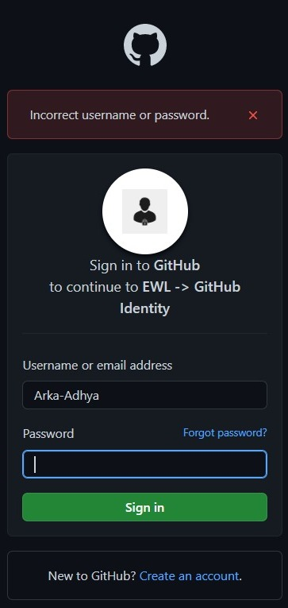

# **GITHUB IDENTITY - (SERVER END)**

## **DESCRIPTION**
This is an Express (Node.js web application framework) application, which acts as the backend server of the project. The Client End application runs on Port 3000. On clicking the **_Sign in with GitHub_** button, the application will request a backend server application which runs on Port 7000, to authenticate the user using their GitHub credentials. Upon successfully logging in to GitHub, the backend server will redirect to the client end application and it will display a success page. The files for the Client End application can be found [here](https://github.com/ewlmentor/AmityKol_GitHubIdentity_ClientApp
).<br><br>


## **INSTALLATION & USE**
* Assuming you’ve already **installed _Node.js_**, **_create a directory_** to hold your application, and make that your **working directory**.
    ```
    $ mkdir gitBack
    $ cd gitBack
    ```
* **Download** all the files i.e, _**gitBack.zip**_ from the repository and **extract** them in the _**gitBack**_ directory.

* **Open _Git Bash_** in the **directory**.

* Use the _**npm init**_ command to create a _**package.json**_ file for your application.
    ```
    $ npm init
    ```

* Use the **_npm package manager_** to **install _express_** in the **gitBack** directory and save it in the dependencies list. For example:

    ```bash
    $ npm install express
     ```
* Similarly using the following commands **_install dotenv_** and **_node-fetch_**
    ```bash
    $ npm install dotenv
    ```

    ```bash
    $ npm install node-fetch
    ```
* **_Open_** the **.env** file in the **root**. Enter the **Client Id** and **Client Secret** generated by the GitHub's O-Auth application, required to authenticate the user.

* Run the following command to start the server. The server will run on **Port 7000**.
    ```bash
    $ node back.js
    ```
    ```js
    app.listen(7000,function(){
    console.log('Backend running on port 7000');
    });
    ```

* Open any web browser and type **localhost:3000**, which will display the Home page of the application.

* Make sure that the Backend Application **back.js** is running as well.

* Click on the **Sign in with GitHub** button, which will redirect to the Backend Application for authentication using GitHub.

* To install and use the client end application follow the steps given [here](https://github.com/ewlmentor/AmityKol_GitHubIdentity_ClientApp
). 


<br><br>
## **SCREENSHOT**
 <br>Enter the credentials to login using GitHub

 <br>Warning shown on entering incorrect credentials.

<br><br>

## **CREDITS**
**Developed by:**
* Arka Adhya <br>
* Rounak Gupta Bhaya <br>
* Abhay Banerjee <br>
* Faizan Ahmad <br>
* Umang Mehrotra <br><br>

**Ziroh Labs, Bengaluru** <br>
* **Mr. Souvik Paul**, _MTS | EWL Mentor_ <br><br>

**Amity University Kolkata** <br>
* **Mr. Anjan Bandyopadhyay**, _Assistant Professor_ <br>
_Department of Computer Science and Engineering,_ <br>
_Amity School of Engineering and Technology,_ <br>
_Amity University Kolkata_