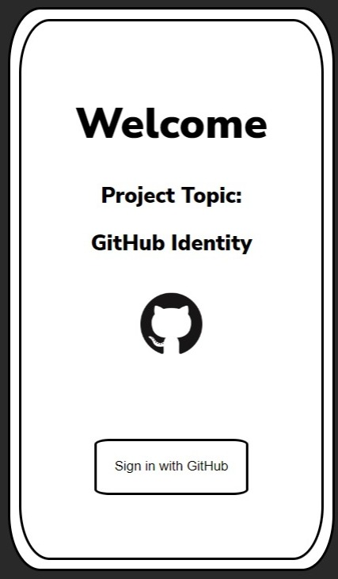

# **GITHUB IDENTITY - (CLIENT END)**

## **DESCRIPTION**
This is an Express (Node.js web application framework) application, which acts as the client end server of the project. The Client End application runs on Port 3000. On clicking the **_Sign in with GitHub_** button, the application will request a backend server application which runs on Port 7000, to authenticate the user using their GitHub credentials. Upon successfully logging in to GitHub, the backend server will redirect to the client end application and it will display a success page. The files for the Backend application can be found [here](https://github.com/ewlmentor/AmityKol_GitHubIdentity_ServerApp
).<br><br>


## **INSTALLATION & USE**
* Assuming you’ve already **installed _Node.js_**, **_create a directory_** to hold your application, and make that your **working directory**.
    ```
    $ mkdir gitFront
    $ cd gitFront
    ```
* **Download** all the files i.e, _**gitFront.zip**_ from the repository and **extract** them in the _**gitFront**_ directory.

* Using any code editor _**change the path**_ accordingly in line numbers 9 and 17 respectively in _**front.js**_
    ```js
    app.get('/', (req, res) => {  
      res.sendFile("F:/gitFront/views/home.html");  // line:9, kindly change the path accordingly
    });
    
    app.get("/success", function (req, res) {
      res.sendFile("F:/gitFront/views/success.html");  // line:17, kindly change the path accordingly  
    
    });
    ```

* **Open _Git Bash_** in the **directory**.

* Use the _**npm init**_ command to create a _**package.json**_ file for your application.
    ```
    $ npm init
    ```

* Use the **_npm package manager_** to **install _express_** in the **gitFront** directory and save it in the dependencies list. For example:

    ```bash
    $ npm install express
     ```

* Run the following command to start the server. The server will run on **Port 3000**.
    ```bash
    $ node front.js
    ```
    ```js
    app.listen(3000,function(){
    console.log('Client running on port 3000');
    });
    ```

* Open any web browser and type **localhost:3000**, which will display the Home page of the application.

* Make sure that the Backend Application **back.js** is running as well.

* Click on the **Sign in with GitHub** button, which will redirect to the Backend Application for authentication using GitHub.

* To install and use the backend server follow the steps given [here](https://github.com/ewlmentor/AmityKol_GitHubIdentity_ServerApp
). 


<br><br>
## **SCREENSHOT**
 <br> Home Page

 <br>Success page on successfully signing in with GitHub

<br><br>

## **CREDITS**
**Developed by:**
* Arka Adhya <br>
* Rounak Gupta Bhaya <br>
* Abhay Banerjee <br>
* Faizan Ahmad <br>
* Umang Mehrotra <br><br>

**Ziroh Labs, Bengaluru** <br>
* Mr. Souvik Paul, _MTS | EWL Mentor_ <br><br>

**Amity University Kolkata** <br>
* Mr. Anjan Bandyopadhyay, _Assistant Professor_ <br>
_Department of Computer Science and Engineering,_ <br>
_Amity School of Engineering and Technology,_ <br>
_Amity University Kolkata_